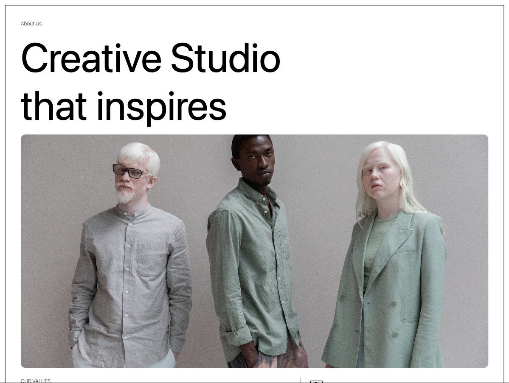
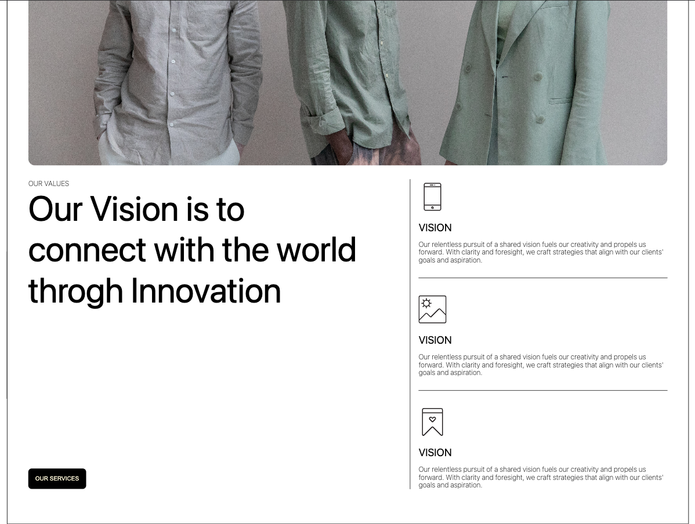
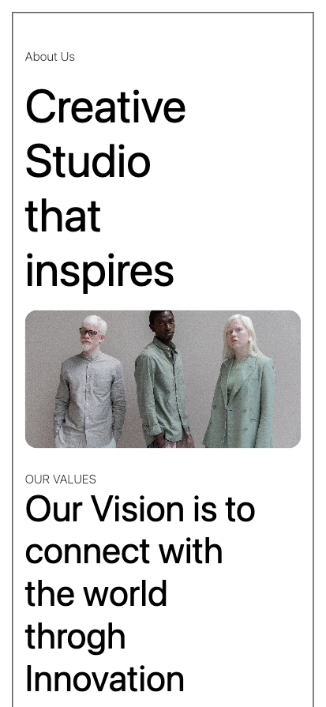
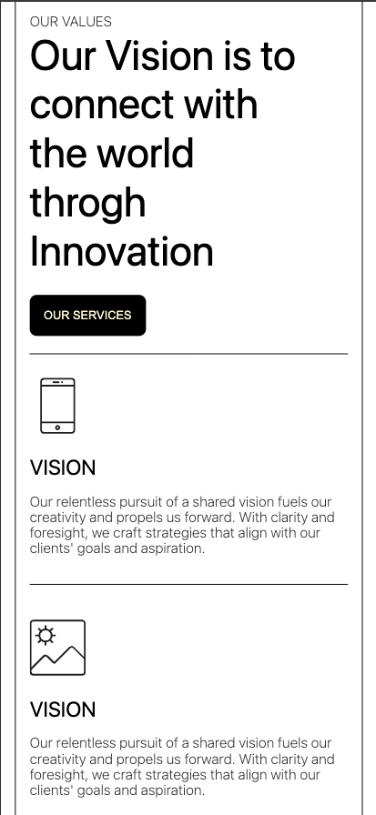

# Responsive Design

## Overview
This project is a fully responsive webpage built using **HTML**, **CSS**, and **SCSS**. It is designed to provide a seamless experience across both **desktop** and **mobile** devices.

## Features
- **Responsive Design**: Ensures optimal viewing and interaction experience on all screen sizes.
- **Flexbox Layout**: Utilizes the `flex` property to create a dynamic and adaptive layout.
- **SCSS Styling**: Leverages SCSS for better organization and maintainability of styles.
- **Modern UI**: Designed with a clean and intuitive user interface.

## Technologies Used
- **HTML**: Structure of the webpage.
- **CSS**: Styling and layout design.
- **SCSS**: Preprocessed CSS for enhanced styling features.
- **Flexbox**: Used for flexible and efficient layout management.

## Screenshots
### Desktop View:

1:
2:

### Mobile View:

1:


2:


## Setup Instructions
1. Clone the repository:
   ```sh
   git clone https://github.com/harbanssinghtoor/ResponsiveDesign.git
   ```
2. Navigate to the project directory:
   ```sh
   cd ResponsiveDesign
   ```
3. Open `index.html` in a browser using LiveServer extension, to view the webpage.

## How It Works
- The **SCSS** file is compiled into **CSS** to apply styles efficiently.
- **Flexbox** is used to ensure dynamic content alignment and responsiveness.
- Media queries allow for adaptive design adjustments on different screen sizes.

## License
This project is licensed under the **MIT License**.
